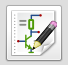

# Kicad Tutorial

## ¿Qué es [Kicad](http://kicad-pcb.org) (http://kicad-pcb.org)?

Es una aplicación open-source formado por diferentes componentes que nos permite diseñar circuitos electrónicos en todas las fases del desarrollo.

Actualmente [recibe apoyo](http://kicad-pcb.org/about/kicad/) de entidades tan importantes como el CERN, la fundación Raspberry o Arduino

Está formado por diferentes herramientas cada una destinada a una parte diferente del proceso de desarrollo.

## Documentación

Existe mucha [documentación](http://kicad-pcb.org/help/documentation/) y traducida a varios idiomas

También disponemos de [diferentes tutoriales](http://kicad-pcb.org/help/tutorials/) y [videotutoriales](http://kicad-pcb.org/help/tutorials/#_video_tutorials) desde un nivel básico hasta uno tan avanzado que nos enseña a [diseñar una placa compatible con Arduino UNO](https://www.youtube.com/user/XploreLabz/videos)

Actualmente estoy seguiendo la serie de [8 vídeos de Applied Electronics](https://www.youtube.com/playlist?list=PLasv3NGTWxRtv5-lh-6zYzKbRS5hVgy1C), que aunque va algo lenta empieza por el orden que a mi me parece más lógico. También tengo apuntado para ver el [vídeo de Windsor Schmidt](https://www.youtube.com/watch?v=zK3rDhJqMu0)

## Instalación en Ubuntu

(La instalación en Windows o mac no parece complicada: en la [página de descargas](http://kicad-pcb.org/download/) tienes los enlaces )

Para instalar la versión stable

    sudo add-apt-repository --yes ppa:js-reynaud/kicad-4
    sudo apt update
    sudo apt install kicad

Si nos gusta estar a la última (aunque con su riesgo...) podemos instalar las build que se generan día a día con la última funcionalidad

    sudo add-apt-repository --yes ppa:js-reynaud/ppa-kicad
    sudo apt update
    sudo apt install kicad

## Creación de un circuito
## Creamos el squema

  

  Colocamos los componentes

## Referencias

[Tutorial Kicad (1/3)](https://hackaday.com/2016/11/17/creating-a-pcb-in-everything-kicad-part-1)
[Tutorial Kicad (2/3)](http://hackaday.com/2016/12/09/creating-a-pcb-in-everything-kicad-part-2/)
[Tutorial Kicad (3/3)](http://hackaday.com/2016/12/23/creating-a-pcb-in-everything-kicad-part-3/)
